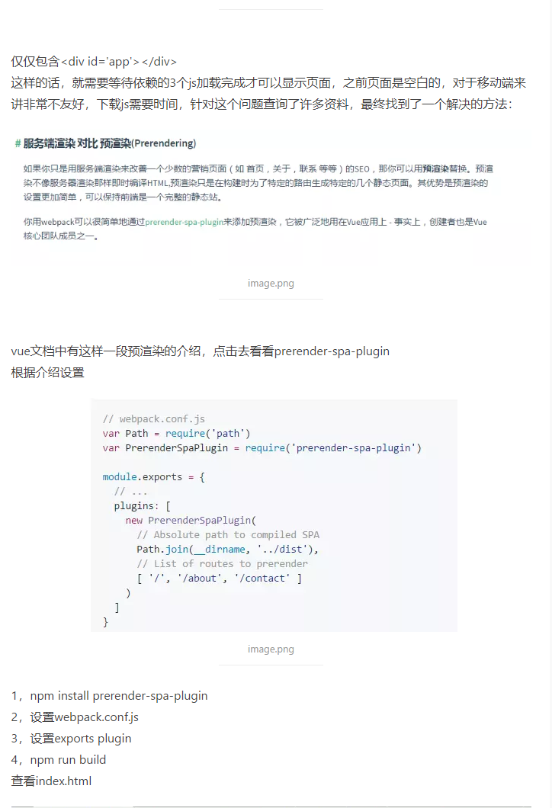

## 1、mint-ui 不能动态插入图片
``` js
    //要加入require包裹url路径

    img: require("@/assets/logo.png")

```
## 2、webAPP首屏加载问题


## 3、定时器立即执行
```js
    function setTime(){}
    //让函数先执行一次
    setTime()
    let timer = setInterval(setTime,1000)
```